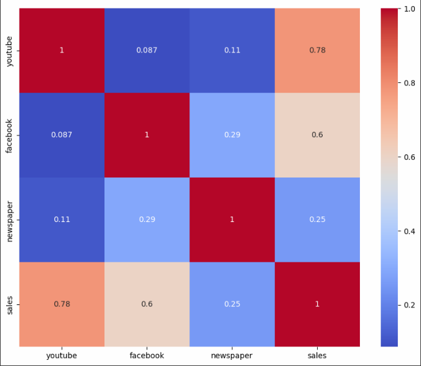
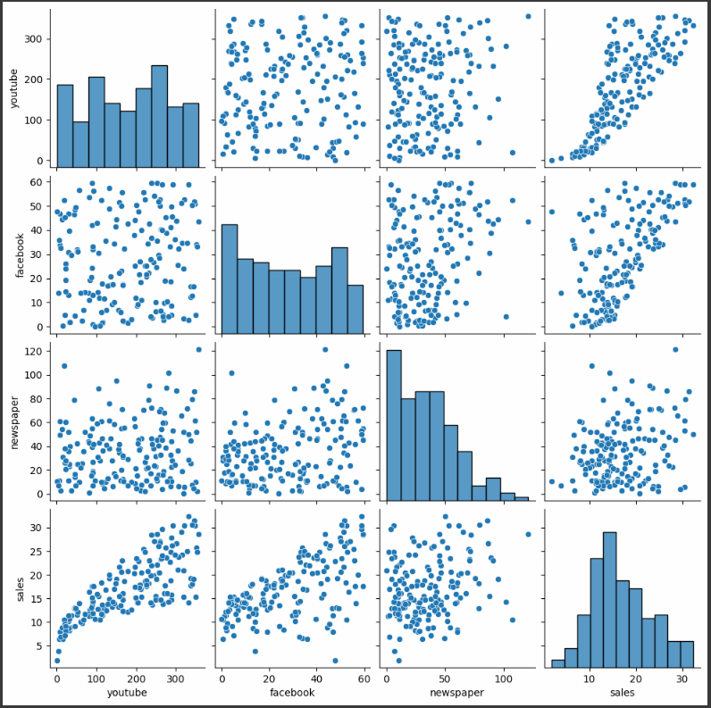

# 📊 Modelo de Regressão para Análise de Impacto de Marketing

   

Bem-vindo ao repositório do projeto de **Modelo de Regressão** desenvolvido como parte do curso de Engenharia de Dados da Escola DNC! Este projeto tem como objetivo avaliar o impacto dos investimentos em publicidade sobre as vendas, utilizando técnicas de análise de dados e machine learning.

---

## 🚀 **Sobre o Projeto**

Este projeto foi desenvolvido para entender como diferentes canais de marketing (TV, Rádio, Jornal) impactam as vendas de um produto. Utilizamos um modelo de regressão linear para prever o retorno sobre o investimento (ROI) e identificar quais canais são mais eficazes.

### **Objetivos:**
- 📈 Analisar o impacto dos investimentos em marketing nas vendas.
- 🛠 Construir e ajustar um modelo de regressão linear.
- 📊 Gerar insights estratégicos para tomada de decisão.

---
## 🛠 **Tecnologias Utilizadas**

Aqui estão as principais ferramentas e tecnologias utilizadas no projeto:

<table align="center" style="text-align: center;">
  <tr>
    <td align="center"></td>
    <td align="center"></td>
    <td align="center"></td>
  </tr>
  <tr>
    <td align="center"></td>
    <td align="center"></td>
    <td align="center"></td>
  </tr>
  <tr>
    <td align="center"></td>
    <td align="center"></td>
    <td align="center"></td>
  </tr>
</table>
---

## 📂 **Estrutura do Repositório**

O repositório está organizado da seguinte forma:

---

## 📊 **Análise Exploratória**

Aqui estão alguns dos insights gerados durante a análise exploratória:

### **Gráfico de Correlação entre Variáveis**

### **Impacto dos Investimentos por Canal**

---

## 🧠 **Modelagem**

Utilizamos um modelo de regressão linear para prever as vendas com base nos investimentos em marketing. Abaixo estão os principais resultados:

### **Coeficientes do Modelo**
| Canal     | Coeficiente |
|-----------|-------------|
| TV        | 0.045       |
| Rádio     | 0.188       |
| Jornal    | 0.001       |

### **Avaliação do Modelo**
- **R² (Coeficiente de Determinação):** 0.89
- **Erro Médio Quadrático (MSE):** 2.56
